# 2026 年中国大学生计算机设计大赛作品报告

作品名称：DermoAI：基于大模型与 SFEPT 的皮肤医学智能辅助诊断平台  
作品类别：人工智能应用 / 大数据实践 / 智慧医疗  
撰写日期：2026 年 4 月  

> 本文档依据《王宇翔_设计与开发文档.pdf》的作品报告结构组织，皮肤病图像分类算法重点参考论文 *Semantic-enhanced few-shot learning for precise dermatological diagnosis*。文档仅描述 DermoAI 当前系统实际展示和使用的核心功能，不展开遗留代码中未纳入作品演示链路的模块。

---

## 目录

第 1 章 作品概述  
第 2 章 问题分析与总体设计  
第 3 章 核心算法与关键技术  
第 4 章 系统实现  
第 5 章 测试分析  
第 6 章 作品总结  
参考文献  
附录：图表与截图清单  

---

# 第 1 章 作品概述

## 1.1 作品背景

皮肤疾病是临床医学中覆盖人群广、复发频率高、表现形态复杂的一类疾病。常见皮肤问题如痤疮、湿疹、银屑病、白癜风、皮炎以及色素痣异常变化等，往往具有明显的视觉表现，但不同疾病之间也可能存在高度相似的纹理、边界、颜色和形态特征。对于普通用户而言，皮肤症状的主观描述容易受到经验不足、用词不准确和风险判断能力有限的影响；对于基层医疗机构、学校医务室、企业健康管理部门等场景而言，专科医生资源不足又使得高频皮肤咨询难以及时分流。

近年来，大语言模型、检索增强生成、医学图像分类和知识图谱等技术为智慧医疗系统提供了新的技术基础。大语言模型能够进行自然语言交互和多轮症状追问，RAG 能够把模型回复锚定到本地医学知识库，少样本图像分类能够缓解医学图像标注困难，数据可视化能够帮助管理者观察问诊趋势与风险分布。DermoAI 正是在这一背景下设计的皮肤医学智能辅助诊断平台，目标是在一个统一 Web 系统中完成“问诊输入、知识检索、图像分析、证据解释、报告生成和数据看板”的闭环。


图1-1 DermoAI 医疗智能平台视觉素材

## 1.2 国内外研究现状与技术依据

从国际研究看，皮肤病智能诊断长期被视为医学人工智能的重要应用场景。Esteva 等人在 Nature 发表的研究表明，深度神经网络可基于大规模皮肤图像数据学习病灶视觉特征，并在皮肤癌二分类任务中达到接近皮肤科医生的判别水平。该研究推动了皮肤图像分类从传统特征工程向端到端深度学习转变，但其依赖大量标注图像，与真实场景中稀有病种样本少、类别长尾和跨设备采集差异明显的问题仍存在矛盾。

在视觉模型方面，Swin Transformer 通过层次化特征表示与移位窗口注意力机制提升了视觉骨干网络对多尺度目标的建模能力，成为图像分类、检测和分割任务的重要基础模型。皮肤病图像往往同时包含颜色、边界、鳞屑、丘疹、水疱、色素变化等细粒度线索，因此相比单纯卷积网络，层次化 Transformer 特征更适合表达局部纹理与全局结构之间的关系。本文所采用的 SFEPT 思想正是在 Swin Transformer、原型网络和少样本学习基础上构建，将类别支持样本映射为原型中心，并通过 Bias Diminishing 缓解支持集与查询集之间的分布偏移。

在国内皮肤病图像智能诊断研究中，少样本学习同样受到关注。国内研究者围绕临床皮肤病图像分类提出多尺度特征融合、度量学习和原型分类等方案，目标在于缓解真实临床数据中标注样本不足、采集设备差异和类别分布不均衡等问题。这类工作说明，皮肤医学图像分类不能只追求封闭数据集上的高准确率，还需要考虑模型在有限支持样本、跨域采集和实际部署环境中的泛化能力。DermoAI 选择少样本原型推理作为图像分类主线，正是为了在竞赛作品中体现面向真实医学场景的工程适配思路。

从国内研究与政策环境看，我国“互联网+医疗健康”和“人工智能+医疗卫生”政策持续强调医疗资源下沉、智能辅助诊疗、健康管理和数据安全监管。《“健康中国2030”规划纲要》提出建设健康信息化服务体系，推进健康医疗大数据应用；国务院办公厅《关于促进“互联网+医疗健康”发展的意见》明确鼓励互联网与医疗健康服务融合，拓展诊前、诊中、诊后线上线下一体化服务；国家卫生健康委等五部门发布的《关于促进和规范“人工智能+医疗卫生”应用发展的实施意见》进一步提出推动基层诊疗智能辅助、医学影像智能辅助诊断和患者智能服务。上述政策为 DermoAI 选择“辅助诊断而非替代诊断”“证据增强而非裸模型问答”“可追溯知识而非黑箱输出”的设计定位提供了现实依据。

在知识增强生成方面，RAG 通过外部知识检索缓解大模型无法及时更新知识和容易产生无依据回答的问题。进一步地，GraphRAG 研究提出将文档语料抽取为实体知识图谱，并利用图社区与实体关系支撑更高层次的问题回答。医学领域已有研究指出，知识图谱问答能够通过实体链接、关系路径和加权路径排序提高专业问答的可解释性；面向中文医学问答的 CMedRAGBot 等工作也说明，将 RAG 与医学知识图谱结合，有助于缓解大模型在临床知识密集任务中的幻觉与知识更新困难。因此，DermoAI 在普通 RAG 的基础上进一步实现 RAGGraph，将疾病、症状、部位、皮损形态、诱因、检查、风险信号和证据来源组织为结构化节点与关系，以支撑“可检索、可解释、可追溯”的医学问诊链路。

综合上述研究与政策基础，DermoAI 的技术路线并非简单叠加大模型和图像分类模型，而是围绕皮肤医学场景构建多源证据协同机制：以 SFEPT 思想解决少样本图像分类问题，以 RAGGraph 解决大模型问诊的证据约束问题，以知识中枢和数据大屏解决系统持续运营与结果复核问题。

## 1.3 作品定位

DermoAI 不是替代医生进行最终诊断的系统，而是面向医疗辅助、健康管理和教学科研场景的智能化工作台。系统以皮肤医学为切入点，将大模型问诊、RAG 证据增强、SFEPT 皮肤病图像分类、知识库管理和数据可视化整合在同一平台，使用户能够在一次连续交互中完成症状描述、图像上传、辅助判断和健康建议查看。

与传统单一聊天机器人或单一图像识别 Demo 相比，DermoAI 更强调工程闭环和证据链设计。系统并不只输出一个疾病名称，而是同时返回分类置信度、Top 结果、规则化提示、大模型辅助分析、知识库引用和图谱路径，从而增强结果的可理解性和可复核性。

## 1.4 核心功能

本作品当前展示链路聚焦五个核心功能域：

| 功能域 | 主要能力 | 对应系统实现 |
| --- | --- | --- |
| 平台总览 | 统一入口、模块导航、企业级医疗工作台界面 | `entrance.html`、`index.html` |
| 智能问诊 | 多轮问诊、流式输出、上下文会话、RAGGraph 证据推理 | `agent.py`、`medical_rag.py`、`rag_graph.py` |
| 皮肤图像分类 | 图像上传、SFEPT 推理、置信度、Top 结果、辅助报告 | `lung.py`、`inference_wrapper.py`、`image_report.py` |
| 医学知识中枢 | 结构化知识维护、PDF/TXT 文档上传、切片入库、检索测试 | `tips.py`、`knowledge_ingest.py` |
| 数据可视化 | 问诊量、知识规模、疾病分布、症状热度、风险提示 | `screen.py`、`screen.html` |

系统中存在部分历史代码和预留接口，但本报告不将其作为作品核心能力展开。文档重点围绕当前实际演示路径，即“皮肤医学智能问诊 + 皮肤图像分类 + 知识增强 + 可视化管理”展开。

## 1.5 作品创新点

1. 面向皮肤医学的多模态辅助诊断闭环  
作品将文本问诊、图像分类、知识检索、图谱证据和数据看板整合为同一业务流程，避免传统系统中“问诊是问诊、识别是识别、知识库是知识库”的割裂问题。

2. 基于 RAGGraph 的可信问诊机制  
系统在大模型生成前先检索医学知识条目和文档切片，再将证据抽象为疾病、症状、部位、皮损形态、检查、风险信号和证据来源等结构化图谱节点，并根据实体命中、关系权重和来源可信度生成候选路径评分，使回答具备可追溯来源，降低生成式模型在医疗场景中的幻觉风险。

3. 参考 SFEPT 的少样本皮肤图像分类推理  
图像分类模块采用 Swin Transformer 进行特征提取，并使用支持集原型、Bias Diminishing 原型修正和距离度量完成分类决策，能够更好适配皮肤疾病样本稀缺、类别长尾和细粒度差异明显的特点。

4. 医学知识资产可运营  
系统支持结构化知识维护和 PDF/TXT 文档上传，上传文档经过抽取、清洗、切片后参与 RAG 检索，使知识库不再是静态页面，而成为可持续更新的医学知识资产。

5. 面向部署迁移的工程设计  
系统通过环境变量管理数据库、大模型接口、模型路径和 CPU/CUDA 推理设备，能够在本地演示、普通 CPU 服务器和 GPU 环境之间切换，降低后续推广成本。

## 1.6 作品技术路线

DermoAI 的技术路线可概括为“Django 工程底座 + RAGGraph 知识增强 + SFEPT 图像分类 + LLM 辅助解释 + ECharts 可视化”。用户从 Web 页面发起问诊或上传图像，后端根据不同任务调用 RAGGraph 引擎、SFEPT 推理服务或大模型接口，结果统一返回前端展示并沉淀到数据库。

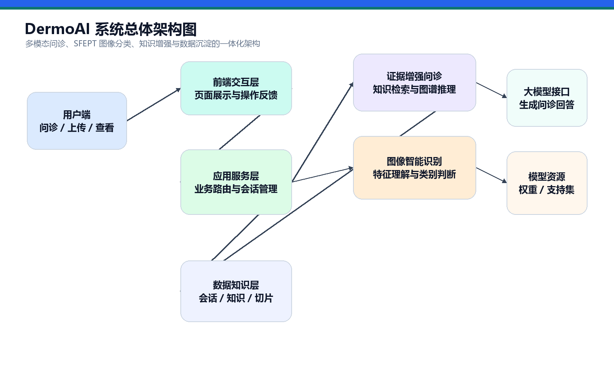

图1-2 系统总体架构图

---

# 第 2 章 问题分析与总体设计

## 2.1 问题来源

皮肤疾病辅助诊断面临三个典型矛盾。

第一，用户需求高频但专科资源有限。许多皮肤问题具有长期反复、早期表现轻微、用户认知不足的特点，用户往往不知道是否需要就医，也难以清晰描述皮损部位、持续时间和伴随症状。智能问诊系统可以在用户就医前完成信息整理和风险提示，为医生复核提供初步线索。

第二，皮肤图像具有明显的少样本和细粒度特征。皮肤病图像中类间差异可能非常细微，例如颜色深浅、边缘规则性、表面鳞屑、形态变化等；同一疾病在不同人群、不同光照、不同拍摄设备下又可能存在较大差异。传统深度学习方法需要大量平衡标注数据，而真实医学数据通常存在隐私限制、标注成本高和长尾类别严重的问题。

第三，医疗 AI 输出必须可解释、可追溯。单纯输出一句“可能是某疾病”无法满足实际使用需求，系统需要说明判断依据、相关知识、建议检查和风险信号，才能在辅助诊疗场景中具备基本可信度。

## 2.2 现有方案不足

### 2.2.1 单一问答系统的问题

传统问答系统多依赖规则库或通用大模型。规则系统可控但覆盖不足，通用大模型表达自然但可能产生无依据回复。对于医疗场景而言，若缺少本地知识库和证据引用，模型回答即使语言流畅，也难以保证专业性和可复核性。

### 2.2.2 单一图像分类系统的问题

传统图像分类系统通常只输出预测类别和概率，难以结合用户主诉与医学知识进一步解释。皮肤图像任务还具有长尾分布和少样本问题，部分类别样本很少，模型容易受到支持样本偏差、拍摄条件变化和类间相似度影响。

### 2.2.3 医学知识管理割裂的问题

许多系统将医学知识作为静态科普内容展示，无法被问诊模型检索，也无法随着 PDF、指南或内部文档更新而动态扩展。这会导致知识库与问诊模型之间缺少联动，难以形成“知识更新—检索增强—问诊解释”的闭环。

## 2.3 解决思路

针对上述问题，DermoAI 采用如下设计思路：

1. 以大模型提供自然语言交互能力，但不直接裸用大模型，而是通过 RAGGraph 检索、实体图谱和证据路径评分约束回答范围。
2. 以 SFEPT 论文中的少样本原型分类思想作为皮肤图像分类基础，使系统适配医学图像样本稀缺和类别细粒度差异。
3. 通过结构化知识表和文档切片表沉淀知识，使医学知识能够被检索、被引用、被图谱化表达。
4. 通过数据大屏统计问诊量、知识规模、疾病分布和症状热度，使系统具备运营观察能力。
5. 通过环境变量配置模型路径、数据库、大模型接口和推理设备，使系统具备企业部署和迁移基础。

## 2.4 总体架构设计

系统采用分层架构，主要包括用户交互层、Django 应用服务层、智能能力层、数据知识层和部署运维层。

| 层级 | 组成 | 职责 |
| --- | --- | --- |
| 用户交互层 | HTML、CSS、JavaScript、ECharts | 页面展示、表单提交、流式响应渲染、图表展示 |
| 应用服务层 | Django URL、View、Template、Session | 路由分发、业务编排、会话管理、文件上传 |
| 智能能力层 | RAGGraph、LLM、SFEPT、影像报告生成 | 问诊生成、证据图谱推理、图像分类、解释生成 |
| 数据知识层 | SQLite/MySQL、医学知识表、文档切片表、图谱实体表、图谱关系表、问诊记录表 | 数据持久化、知识沉淀、证据追踪 |
| 部署运维层 | `.env`、模型目录、CPU/CUDA 配置、Media 文件 | 环境配置、模型加载、文件管理和部署适配 |


图2-1 系统总体架构图

## 2.5 功能模块设计

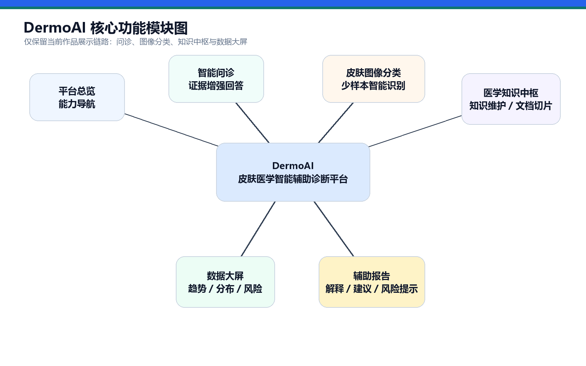

图2-2 系统核心功能模块图

功能模块设计围绕当前作品展示链路展开。平台总览负责统一入口和模块导航；智能问诊负责用户症状输入、RAG 检索、模型回复和证据展示；皮肤图像分类负责图像上传、SFEPT 推理和辅助报告；知识中枢负责医学知识维护与文档入库；数据大屏负责统计系统运行状态和问诊数据。

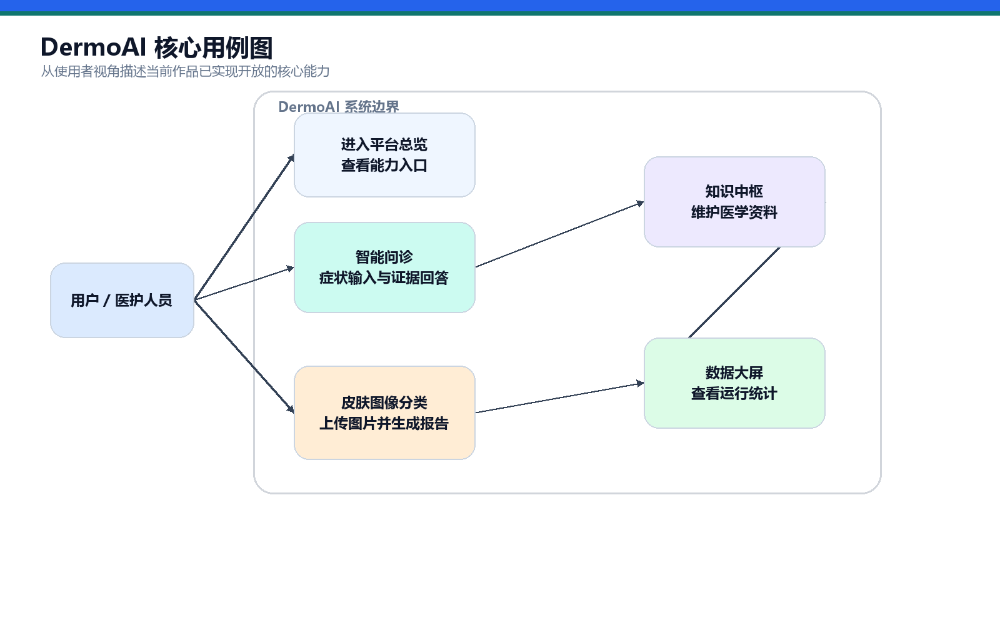

图2-3 系统核心用例图

## 2.6 数据库设计

系统核心数据实体包括医学知识、知识文档、知识切片、图谱实体、图谱关系、问诊会话、问诊消息和用户信息。其设计重点在于同时支持“结构化知识”“非结构化文档切片”和“图结构证据网络”，并将智能问诊过程中产生的引用依据、图谱路径和结构化 RAGGraph 结果保存下来。

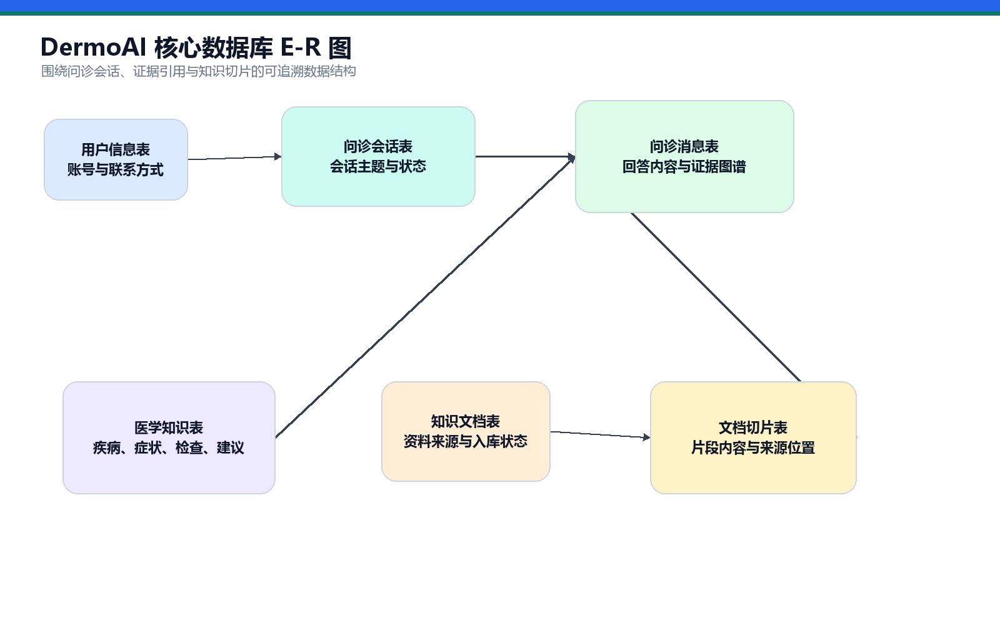

图2-4 核心数据库 E-R 图

表2-1 核心数据表说明

| 数据表 | 作用 | 关键字段 |
| --- | --- | --- |
| `MedicalKnowledge` | 保存结构化医学知识 | disease、symptoms、check_items、advice |
| `KnowledgeDocument` | 保存上传的知识文档 | title、file、file_type、status、total_chunks |
| `KnowledgeChunk` | 保存文档切片 | document、chunk_index、page_label、content、token_estimate |
| `KnowledgeEntity` | 保存医学图谱实体 | name、normalized_name、entity_type、description、confidence |
| `KnowledgeRelation` | 保存医学图谱关系 | subject、relation_type、object、weight、evidence_text |
| `DiagnosisConversation` | 保存问诊会话 | title、session_key、user、summary、updated_at |
| `DiagnosisMessage` | 保存问诊消息 | role、content、references、graph_paths、graph_payload、model_used |
| `UserProfile` | 保存用户信息 | username、avatar、real_name、phone |

---

# 第 3 章 核心算法与关键技术

## 3.1 SFEPT 图像分类核心技术方案

DermoAI 的皮肤病图像分类算法以 *Semantic-enhanced few-shot learning for precise dermatological diagnosis* 提出的 SFEPT（Semantic Feature Enhanced Prototypical Transformer）为核心技术路线。皮肤病图像具有典型的细粒度医学影像特征：一方面，不同疾病之间可能只在颜色深浅、边界形态、鳞屑纹理、丘疹密度或色素沉着模式上存在细微差别；另一方面，同一疾病在不同肤色、拍摄设备、光照条件、病灶部位和病程阶段下又会呈现较大的类内差异。因此，传统依赖大规模均衡标注数据的闭集分类范式难以充分适应皮肤病长尾分布和稀有类别识别需求。

SFEPT 的设计思想是将“层次化视觉编码、原型度量学习、分布偏移校正和语义先验增强”统一到一个少样本分类框架中。系统首先利用 Swin Transformer 提取皮肤图像的多尺度视觉表征；随后根据支持集构建类别原型，并通过 Prototype Rectification 与 Bias Diminishing 机制缓解少样本原型偏移；在此基础上，Semantic-Aware Enhancement（SAE）模块将视觉特征投影到冻结 BERT 所形成的潜在语义流形中，以高层语义先验增强细粒度判别能力；最终通过查询样本与修正原型之间的距离度量输出类别概率。该技术方案兼顾医学图像的视觉细节表达、少样本场景下的稳定泛化和临床辅助系统所需的推理效率。

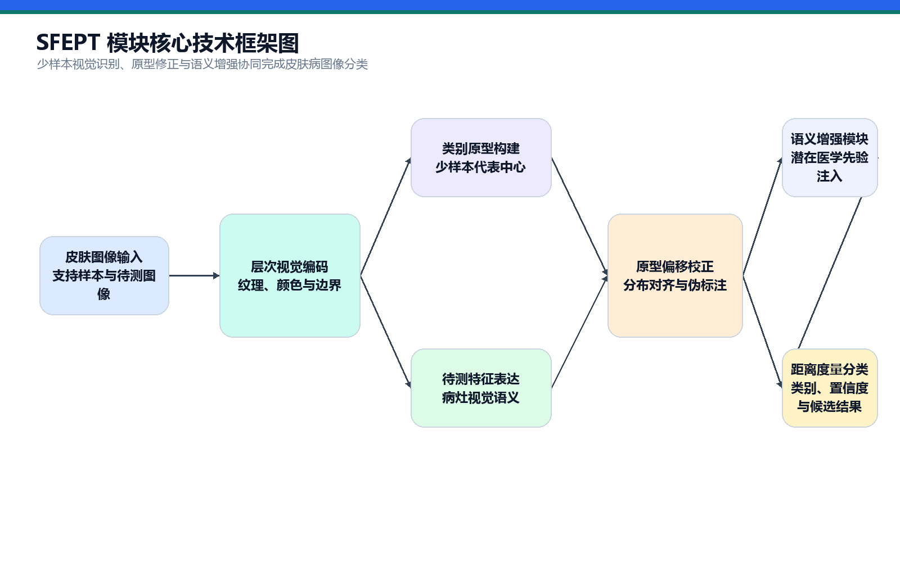

图3-1 SFEPT 模块核心技术框架图

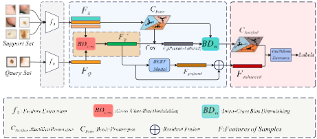

图3-2 SFEPT 算法结构参考图

## 3.2 少样本皮肤病分类任务建模

系统将皮肤病图像识别建模为 \(N\)-way \(K\)-shot 少样本分类任务。对于每一次分类任务 \(T\)，其由支持集 \(S\) 和查询集 \(Q\) 共同构成：

$$
T=(S,Q)
$$

其中支持集定义为：

$$
S=\{(x_i,y_i)\}_{i=1}^{N\times K}
$$

查询集定义为：

$$
Q=\{(x_j,y_j)\}_{j=1}^{M}
$$

式中，\(x\in R^{H\times W\times C}\) 表示输入皮肤图像，\(y\in\{1,2,\ldots,N\}\) 表示疾病类别标签，\(N\) 表示当前任务中的类别数，\(K\) 表示每个类别可用于构建原型的支持样本数量。少样本学习并不直接学习固定类别的最终分类器，而是学习一种可迁移的度量空间，使模型能够在遇到新类别时，仅依赖少量支持样本快速建立类别判别边界。

本系统图像分类模块的数据来源与推理配置以本地 FSL_skin 工程为准，原始皮肤病图像类别目录位于 `D:\AI\FSL_skin\data\CUB\sd-198\images`，对应 SD-198 数据集的 198 个皮肤病图像类别。系统通过 `D:\AI\FSL_skin\data\CUB\test.json` 装配少样本支持集，读取其中的 `class_names` 与 `class_roots`，再从 `sd-198/images` 下加载每类代表样本构造原型。该设计使模型能力边界由真实数据集和支持集配置决定，避免将少数常见皮肤病名称简单等同于完整模型类别空间。

从工程视角看，少样本任务建模使 DermoAI 具备较强的扩展性。当新增疾病类别时，系统可以通过补充该类别的支持样本和类别配置更新原型空间，而不需要完全依赖大规模重新标注与端到端再训练。这种“支持集驱动”的分类机制更贴近基层皮肤病辅助筛查、教学样本演示和企业健康管理中的低样本、快部署需求。

## 3.3 Swin Transformer 层次化视觉特征提取

SFEPT 采用 Swin Transformer 作为视觉特征提取骨干网络。与传统卷积网络相比，Swin Transformer 通过窗口自注意力与层次化特征金字塔结构，在保持计算效率的同时兼顾局部纹理和全局上下文。皮肤图像中的病灶区域往往同时包含局部细节和整体形态，例如局部鳞屑、丘疹边缘、色素网络、红斑扩散范围以及病灶与周围正常皮肤的过渡关系，这类特征天然适合通过层次化注意力结构进行建模。

给定输入图像 \(x_i\)，特征提取器 \(f_\theta(\cdot)\) 将其映射为高维视觉嵌入：

$$
F_i=f_\theta(x_i)
$$

对于支持集和查询集，模型分别得到：

$$
F_S=f_\theta(S),\quad F_Q=f_\theta(Q)
$$

Swin Transformer 的核心计算可抽象为多头自注意力机制。设 \(Q_m\)、\(K_m\)、\(V_m\) 分别表示第 \(m\) 个注意力头中的查询、键和值矩阵，则注意力输出可表示为：

$$
\operatorname{Attention}(Q_m,K_m,V_m)=\operatorname{softmax}\left(\frac{Q_mK_m^T}{\sqrt{d_k}}\right)V_m
$$

多头注意力进一步将不同子空间中的注意力结果拼接并投影：

$$
\operatorname{MHA}(X)=\operatorname{Concat}(head_1,\ldots,head_h)W^O
$$

其中：

$$
head_m=\operatorname{Attention}(XW_m^Q,XW_m^K,XW_m^V)
$$

通过上述机制，模型能够在不同尺度上捕捉皮肤病灶的结构性差异。对于细粒度皮肤病分类而言，这种特征表达不仅关注图像中是否存在明显病灶，还关注病灶边缘是否规则、颜色分布是否均匀、纹理是否粗糙、病灶形态是否呈斑块状或丘疹状等更具医学判别价值的视觉线索。

## 3.4 原型网络与类别中心构建

在少样本分类中，类别原型是连接支持样本和查询样本的核心中间表示。SFEPT 在视觉特征空间中为每一个类别构建一个中心向量，用于表示该类别的典型视觉模式。设第 \(n\) 类支持样本集合为 \(S_n\)，其包含 \(K\) 张图像，则初始类别原型 \(c_n\) 定义为：

$$
c_n=\frac{1}{K}\sum_{j=1}^{K}f_\theta(x_j^{(n)})
$$

其中，\(x_j^{(n)}\) 表示第 \(n\) 类中的第 \(j\) 个支持样本。全部类别原型组成原型矩阵：

$$
C=\{c_1,c_2,\ldots,c_N\}
$$

与普通分类器直接学习类别权重不同，原型网络将类别表示建立在支持样本的特征均值之上。这一机制的优势在于，模型对类别数量不作固定假设，能够根据支持集动态构造任务相关类别空间。对于 SD-198 这类类别数量多、长尾特征明显的皮肤病数据集，原型学习能够将模型从“记忆固定类别”转向“学习可迁移的疾病表征空间”，从而提升对低样本类别和新增类别的适应能力。

然而，直接使用支持集均值作为类别中心也存在不足。由于每类仅有少量支持样本，初始原型容易受到样本选择、拍摄角度、光照条件、病灶阶段和个体肤色差异影响，导致原型偏离真实类别分布中心。因此，SFEPT 在初始原型基础上进一步引入原型修正机制。

## 3.5 Prototype Rectification 与 Bias Diminishing

Prototype Rectification 的目标是降低少样本支持集带来的原型估计偏差，使类别中心更接近真实数据流形。皮肤病图像具有明显的采集域差异：同一疾病在不同相机、不同光照、不同皮肤区域和不同病程阶段下可能呈现不同视觉分布。如果直接用支持集均值进行分类，查询样本分布与支持样本分布之间的偏移会被放大，进而影响分类稳定性。

SFEPT 首先通过 Bias Diminishing 进行分布对齐。设支持集特征均值为 \(\mu_S\)，查询集特征均值为 \(\mu_Q\)，则分布偏移向量可表示为：

$$
\Delta=\mu_S-\mu_Q
$$

对查询样本特征 \(F_q\) 进行均值平移校正：

$$
F'_q=F_q+\Delta
$$

该步骤将查询特征整体移动到与支持集更一致的特征分布区域中，从几何角度缩小支持域与查询域之间的偏移。随后，模型利用校正后的查询特征与初始原型计算相似度，并为查询样本分配伪标签：

$$
\hat{y}_q=\arg\max_k \operatorname{cos}(F'_q,c_k)
$$

对于被分配到第 \(k\) 类的支持样本和高置信度伪标注查询样本，系统采用软权重方式重新估计类别原型。样本权重由其与当前类别原型的相似度决定：

$$
w_i=\frac{\exp(\beta\cdot \operatorname{cos}(x_i,c_k))}
{\sum_{x_j\in S_k\cup Q_k}\exp(\beta\cdot \operatorname{cos}(x_j,c_k))}
$$

其中，\(\beta\) 为温度系数，\(S_k\) 表示第 \(k\) 类支持样本集合，\(Q_k\) 表示被伪标注为第 \(k\) 类的查询样本集合。修正后的类别原型可表示为：

$$
c'_k=\sum_{x_i\in S_k\cup Q_k}w_i f_\theta(x_i)
$$

通过“分布对齐 + 伪标签更新 + 加权原型重估”，Prototype Rectification 将初始原型从稀疏支持样本均值提升为更贴近任务数据分布的判别中心。该过程不依赖复杂迭代优化，也不会显著增加推理开销，适合部署在 Web 医疗辅助系统中进行快速响应。

## 3.6 Semantic-Aware Enhancement 与分类输出

在皮肤病细粒度分类中，视觉相似并不意味着医学语义相同。例如，色素痣、黑色素瘤、脂溢性角化病等疾病可能在局部颜色和形态上存在相似性，但其医学风险等级和诊断语义差异较大。为增强模型对高层疾病语义的感知能力，SFEPT 引入 Semantic-Aware Enhancement（SAE）模块，将视觉特征投影到冻结 BERT 所蕴含的潜在语义流形中。

SAE 模块并非依赖长文本提示或人工编写描述，而是将校正后的视觉特征视为单 token 向量，通过可学习投影层对齐到语义嵌入空间。设修正后的查询特征为 \(F'_Q\)，投影矩阵为 \(W_p\)，则语义输入嵌入为：

$$
E_{in}=\operatorname{Unsqueeze}(F'_QW_p)
$$

随后将单 token 嵌入输入冻结 BERT：

$$
E_{out}=\operatorname{Squeeze}(\operatorname{BERT}_{frozen}(E_{in}))
$$

由于序列长度被约束为 \(1\)，该过程避免了长文本序列带来的高复杂度，使 BERT 在系统中更接近“语义几何投影器”：它利用预训练语言模型内部的概念拓扑结构，对视觉特征进行语义规则化。最后，SAE 采用残差融合方式保留原始视觉细节并注入语义先验：

$$
F_{enhanced}=F'_Q+E_{out}
$$

在分类阶段，系统计算增强查询特征与修正原型之间的距离或相似度。若采用欧氏距离，则第 \(n\) 类得分可表示为：

$$
s_n=-\lVert F_{enhanced}-c'_n\rVert_2
$$

对应概率分布为：

$$
P(y=n|x)=\frac{\exp(s_n)}{\sum_{m=1}^{N}\exp(s_m)}
$$

最终预测类别为：

$$
\hat{y}=\arg\max_n P(y=n|x)
$$

模型训练采用 episodic learning 策略，使训练任务形式与测试任务形式保持一致。每个 episode 随机采样 \(N\) 个类别，并为每个类别采样 \(K\) 个支持样本和若干查询样本。训练流程依次完成特征提取、Bias Diminishing、原型修正、SAE 语义增强、距离度量和损失反向传播。推理流程则以用户上传图像作为查询样本，以当前支持集配置构建类别原型，输出预测类别、置信度和 Top 结果，为后续大模型解释报告提供结构化依据。

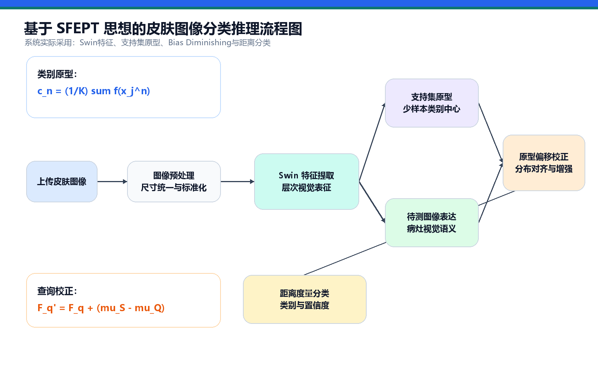

图3-3 基于 SFEPT 思想的皮肤图像分类推理流程图

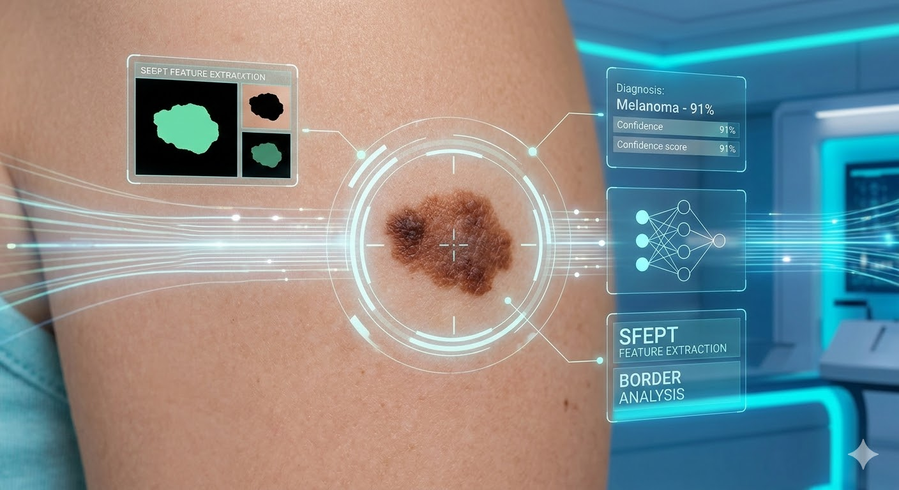

图3-4 皮肤图像分类模型展示素材

## 3.7 RAGGraph 智能问诊算法

DermoAI 的智能问诊不是简单调用大模型，而是采用“实体识别—多源检索—图谱扩展—路径评分—证据增强生成—结果存证”的 RAGGraph 流程。用户输入症状后，系统首先从问句中抽取皮肤医学相关实体，例如部位、皮损形态、症状、诱因和风险信号；随后从结构化医学知识和文档切片中检索相关内容；再将检索结果转化为医学图谱节点与关系，形成可追溯的证据网络。大模型生成结果时同时接收用户问题、历史会话、RAG 证据和 RAGGraph 路径，从而生成更具医学边界、证据意识和可复核性的回答。

RAGGraph 问诊流程可表示为：

$$
A=LLM(q,H,R(q),G_q,R_s(q))
$$

其中，\(q\) 表示用户问题，\(H\) 表示历史对话，\(R(q)\) 表示检索到的医学证据，\(G_q\) 表示由疾病、症状、检查、风险信号和证据来源构成的查询相关图谱，\(R_s(q)\) 表示带有评分的候选诊断路径集合，\(A\) 表示生成的问诊回答。

在系统实现中，`medical_rag.py` 负责问诊流程编排，`rag_graph.py` 负责实体抽取、关系构建、路径评分和图谱结果持久化。图谱节点包括 `disease`、`symptom`、`body_part`、`morphology`、`trigger`、`check`、`risk`、`care`、`evidence` 等类型；图谱关系包括 `HAS_SYMPTOM`、`LOCATED_AT`、`HAS_MORPHOLOGY`、`TRIGGERED_BY`、`NEEDS_CHECK`、`RISK_SIGNAL`、`SUGGESTS_CARE`、`EVIDENCED_BY` 等类型。与普通文本 RAG 相比，RAGGraph 不仅返回文本证据，还返回节点、边、路径、候选疾病评分和命中实体，便于前端构建“证据推理面板”。

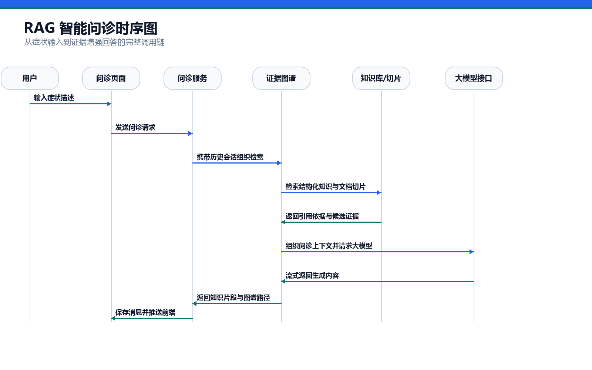

图3-5 RAG 智能问诊时序图

## 3.8 RAGGraph 路径评分与证据融合

RAGGraph 的关键在于将“检索到的文本片段”进一步转化为可排序、可解释的图路径。设查询 \(q\) 中识别出的实体集合为 \(E_q\)，检索证据集合为 \(D_q\)，由证据构建的图谱为：

$$
G_q=(V_q,E_q^r)
$$

其中，\(V_q\) 表示疾病、症状、检查、风险信号等实体节点集合，\(E_q^r\) 表示节点之间的医学关系集合。对于候选疾病 \(d_i\)，系统综合检索相关度、实体命中、关系权重和来源可信度计算路径评分：

$$
Score(d_i)=0.45S_{ret}+0.35W_{rel}+0.20H_{ent}
$$

其中，\(S_{ret}\) 表示证据检索得分归一化结果，\(W_{rel}\) 表示关系类型权重，\(H_{ent}\) 表示查询实体与图谱节点之间的命中程度。对于节点本身，系统进一步考虑实体类型和证据来源可信度：

$$
Score(v)=0.45+B_{type}+0.18H_{query}+0.16T_{source}
$$

其中，\(B_{type}\) 表示风险信号、皮损形态、症状、检查等不同实体类型的权重偏置，\(H_{query}\) 表示节点是否直接命中用户输入，\(T_{source}\) 表示证据来源可信度。该设计使系统能够将“手背、红斑、瘙痒、脱屑”等主诉转化为带权图谱路径，例如：

$$
\text{红斑 + 瘙痒 + 脱屑} \rightarrow \text{支持候选} \rightarrow \text{湿疹}
$$

系统最终返回 `graph_payload`，其中包含 `nodes`、`edges`、`routes`、`query_entities` 和 `metrics`。前端根据节点类型展示不同颜色和层级，根据路径评分展示候选疾病排序，根据证据文本展示可追溯来源，从而把大模型问诊结果从“自然语言回答”提升为“自然语言 + 证据图谱 + 路径解释”的复合输出。

## 3.9 医学知识切片与检索

医学知识中枢支持结构化知识和非结构化文档两类来源。结构化知识以疾病、症状、检查和建议形式保存；非结构化文档则通过 PDF/TXT 上传后进行文本抽取、规范化和递归切片。

文档切片采用固定窗口与医学文本分隔符结合的策略。设原始文档文本为 \(D\)，切片函数为 \(\phi(\cdot)\)，则：

$$
\{C_1,C_2,\ldots,C_t\}=\phi(D)
$$

每个切片 \(C_i\) 保存内容、页码标签、序号、字符偏移和 token 估算。检索时系统将用户问题中的关键词与结构化知识、文档切片进行匹配，得分较高的片段进入 RAG 上下文。

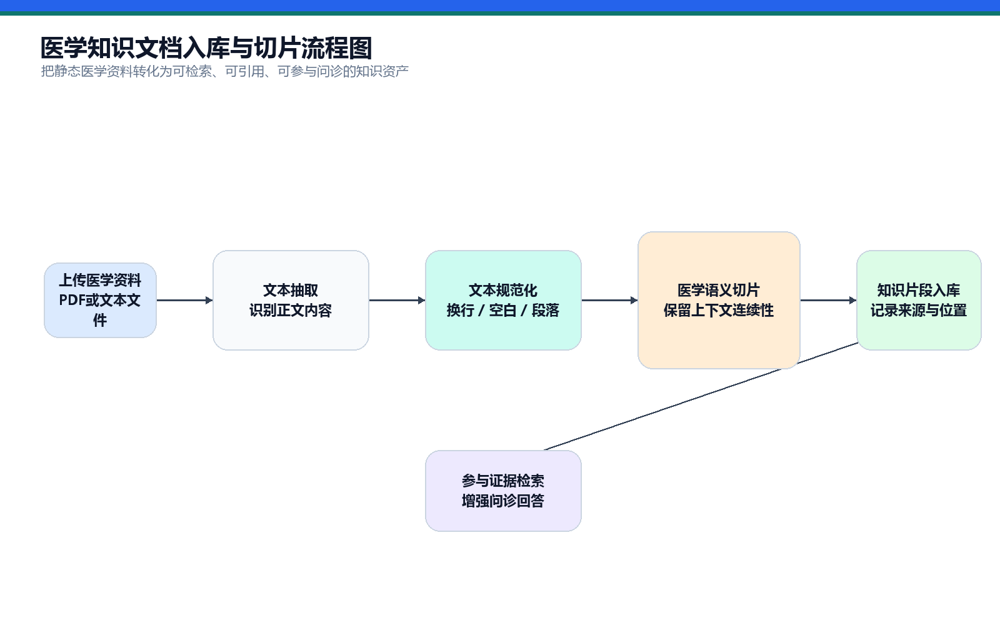

图3-6 医学知识文档入库与切片流程图

## 3.10 大模型辅助报告生成

皮肤图像分类结果本身通常只是类别和置信度，普通用户不一定能理解其医学意义。因此系统在分类结果基础上进一步生成辅助报告。报告生成模块接收图像分类结果、Top 预测和基础提示，调用大模型生成影像观察、结果解释、就医建议和风险提示。当大模型接口不可用时，系统返回本地 fallback 报告，保证核心流程不中断。

该设计使图像分类结果从“模型输出”转化为“可读医学辅助说明”，提升系统的产品化表达能力。

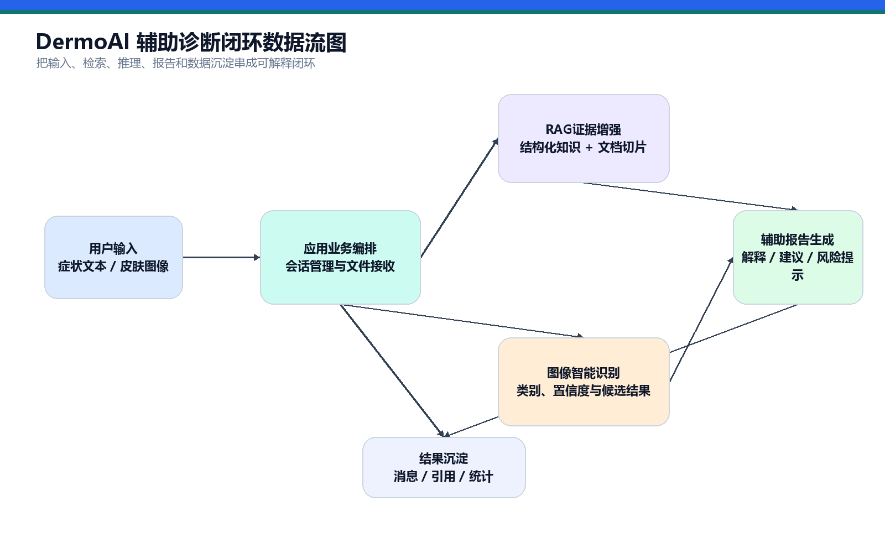

图3-7 辅助诊断闭环数据流图

---

# 第 4 章 系统实现

## 4.1 开发环境与运行环境

为保证系统在本地开发、作品答辩演示和后续部署迁移中的一致性，DermoAI 采用“Python 后端服务 + 医学智能算法组件 + 可配置模型接口 + 前端可视化工作台”的分层实现方式。系统以 Django 为主干框架完成页面路由、会话管理、数据持久化与接口编排，以 PyTorch 为核心承载视觉模型推理，以 LangChain 与 OpenAI 兼容接口封装大模型交互，以 ECharts 完成统计看板和图谱型前端展示。整体运行环境既支持轻量级 SQLite 演示模式，也保留面向正式部署的 MySQL 切换能力，便于在不同比赛或实验环境中快速复现。

表4-1 开发与运行环境

| 类型 | 配置 |
| --- | --- |
| 开发语言 | Python、HTML、CSS、JavaScript |
| 后端框架 | Django 5.1.7 |
| 数据持久化 | SQLite 默认，可扩展为 MySQL |
| AI 框架 | PyTorch、TorchVision、timm、LangChain |
| 图像处理 | Pillow、OpenCV、NumPy |
| 文档解析 | pypdf / PyPDF2 兼容读取 |
| 前端可视化 | ECharts、原生模板渲染 |
| 大模型接入 | DeepSeek / OpenAI 兼容接口 |
| 运行配置 | `.env` 环境变量、`settings.py` 动态加载 |
| 推理设备 | CPU、CUDA 自动识别或手动指定 |

上述环境设计体现出较强的工程适应性。一方面，系统核心流程并不依赖单一硬件条件，能够在普通 CPU 环境下完成问诊、知识检索和页面演示；另一方面，在具备 CUDA 条件的机器上又可以无缝启用 GPU 加速，以支撑皮肤图像分类等相对重计算模块。该设计使作品既具备竞赛答辩中的稳定展示能力，也具备向实际应用环境迁移的可行性。

## 4.2 平台总览实现

平台总览承担系统统一入口与功能编排中心的角色，对应 `/` 与 `/index/` 路由。其实现目标并非简单罗列页面链接，而是将原本分散的图像诊断、智能问诊、知识中枢和可视化分析能力组织为具备企业级产品逻辑的一体化医疗 AI 门户。前端采用顶部统一导航、核心能力卡片、关键指标概览和快捷操作区相结合的结构，使不同角色用户均可在较短时间内理解系统定位并进入目标工作流。

从实现机制看，平台总览页不仅承担静态展示功能，还负责对系统运行状态进行聚合计算。后端通过会话记录、消息记录、知识条目规模和模型配置状态构造页面上下文，前端据此展示今日问诊量、活跃会话、知识库规模、RAG 命中情况等关键指标。这种“入口页即总览页”的设计，避免了传统教学系统首页“文字堆叠、信息离散”的问题，使作品在答辩展示时能够首先呈现出清晰的产品边界和完整的能力闭环。

图4-1 平台首页截图  
[此处插入：图4-1 平台首页截图 - 建议截取 `/` 页面]

图4-2 平台总览截图  
[此处插入：图4-2 平台总览截图 - 建议截取 `/index/` 页面]

平台总览在交互设计上突出以下三点：

1. 统一导航。通过固定顶栏与主模块按钮建立稳定的信息架构，降低跨页面切换成本。
2. 业务聚焦。以“进入问诊”“进入图像诊断”“查看算法解析”等高频动作作为首页主操作，强化系统的任务导向属性。
3. 状态可感知。通过系统状态卡、统计指标和病例摘要，将算法能力、知识规模与运行态势转化为可直接理解的可视化信息。

图4-3 系统首页相关视觉素材

## 4.3 智能问诊工作台实现

智能问诊工作台是 DermoAI 的核心交互中枢，对应 `/agent/` 路由，关键实现位于 `app01/views/agent.py`、`app01/services/medical_rag.py` 和 `app01/services/rag_graph.py`。该模块并非单纯调用大模型生成文本，而是构造了“会话记忆保持 + 医学知识检索增强 + 图谱证据推理 + 流式回复输出”的复合型问诊链路。

在数据组织层面，系统采用 Session、会话表与消息表三层协同机制实现轻量化用户状态管理。`_ensure_session` 负责为匿名访问用户建立稳定会话标识；`DiagnosisConversation` 用于保存单次问诊主题、摘要与更新时间；`DiagnosisMessage` 则分别记录用户输入、系统输出、参考依据、图谱路径及模型来源。该设计使问诊过程从“一次性回答”提升为“可持续追踪、可回放、可归档”的诊疗辅助工作流。

在请求处理层面，系统同时提供普通响应接口 `chat_message` 与流式响应接口 `chat_message_stream`。前者适合标准问答与调试联调，后者借助 SSE 按片段推送模型输出，在实际使用中能够显著改善交互连贯性和即时反馈体验。流式接口在输出过程中同步保留最终回答、引用依据和图谱结构，从而保证前端展示的完整性与后端存储的一致性。

该模块的核心实现过程可概括为以下四个阶段。

第一阶段为症状输入理解与会话上下文装配。系统首先对输入文本进行空值校验，并根据 `conversation_id` 获取当前活动会话或创建新会话；随后提取历史消息形成上下文序列，为后续问诊提供连续语义背景。

第二阶段为 RAG 检索与候选证据生成。`medical_rag_engine.retrieve` 会同时查询结构化医学知识、文档切片和图谱关联内容，形成多源候选证据。与传统仅依赖关键词匹配的实现不同，本系统在检索层引入结构化知识、文本切片和图关系三种证据形态，增强了回答内容的医学可追溯性。

第三阶段为 RAGGraph 结构化推理。`medical_rag_engine.build_graph` 与 `rag_graph.py` 中的相关逻辑会围绕查询实体构造节点、关系边和候选路径，并计算图谱命中实体、局部证据数量、全局图谱证据数量、平均路径得分等指标。由此，系统不仅能够回答“可能是什么”，还能够向用户展示“这一判断由哪些证据支持、这些证据如何通过关系链路组织起来”。

第四阶段为大模型生成与结果沉淀。系统将用户问题、历史上下文、RAG 证据和图谱路径共同送入大模型，生成结构化辅助建议，并将最终结果连同 `references`、`graph_paths` 和 `graph_payload` 一并写回数据库。该过程形成了从输入、检索、推理到归档的闭环，既便于前端实时展示，也为后续统计分析和质控回溯保留了依据。

前端工作台的实现重点在于将后端返回的结构化证据可视化。系统在右侧证据区域展示知识图谱节点、关系边、候选路径与统计指标，不再停留于“引用几段文本”的浅层增强，而是尽可能将症状、疾病、检查、风险信号和处理建议组织为可解释的推理网络。对于医疗 AI 系统而言，这种可解释界面的实现具有重要意义：它能够在一定程度上缓解黑箱式生成带来的可信度问题，使系统更符合医学辅助决策场景对于透明性和可审阅性的要求。

图4-4 智能问诊工作台截图  
[此处插入：图4-4 智能问诊工作台截图 - 展示会话列表、输入区、回复区和证据区域]


图4-5 AI 问诊视觉素材

## 4.4 皮肤图像分类实现

皮肤图像分类模块对应 `/diagnose_skin/`、`/diagnose_skin/upload/` 和 `/diagnose_skin/predict/` 等接口，核心实现位于 `app01/views/lung.py` 及 `SkinFSLPredictor` 相关推理组件。虽然路由历史上保留了部分兼容命名，但当前系统已将其统一收敛到皮肤病图像辅助识别场景中。

该模块的实现重点不在于简单上传图片并返回标签，而在于构建一条具备工程可用性的医学视觉推理链路。为避免每次请求重复加载模型权重和支持集，系统通过 `get_predictor()` 构造预测器单例，在首个请求到来时完成模型初始化，后续请求直接复用已有实例。这一设计有效降低了重复初始化带来的时延开销，也提升了答辩演示和在线访问场景下的稳定性。

从处理流程看，图像分类模块主要包含以下步骤：首先由上传接口接收用户图像并写入指定目录；随后在预测接口中读取上传图像或内存图像对象，将其转换为统一 RGB 格式；之后交由 `SkinFSLPredictor` 完成特征提取、支持集匹配与类别判别；最后由后处理逻辑生成类别名称、置信度、Top 候选结果以及面向用户可理解的辅助建议文本。

在结果组织方面，系统不仅返回单一预测标签，还输出能够支撑前端结果页构建的完整结构化字段，如表4-2所示。

表4-2 图像分类返回字段设计

| 字段 | 含义 |
| --- | --- |
| `predicted_class` | 预测类别索引 |
| `predicted_class_name` | 预测类别名称 |
| `confidence` | 置信度原始值 |
| `confidence_percent` | 百分比形式置信度 |
| `tips` | 与预测类别相关的基础提示 |
| `top_predictions` | 候选类别排序结果 |
| `ai_analysis` | 大模型或本地 fallback 生成的辅助报告 |

其中，`top_predictions` 的保留使前端能够展示候选疾病排序而非单点结论，有助于在类别边界相近、病灶视觉特征相似的情况下提供更稳健的辅助判断视角。`ai_analysis` 则将视觉模型输出进一步转化为更适合人机交互的自然语言解读，即便外部大模型接口未配置成功，系统也能够通过本地 fallback 机制返回基本分析结果，保证识别链路不断裂。

此外，系统在展示层面对图像结果进行了产品化封装。页面不仅呈现分类名称和置信度，还结合提示建议、病例风格描述和辅助报告，增强了输出结果的可读性与医学语境适配性。这一实现使视觉模块不再是孤立的算法演示页，而是被纳入完整的医疗 AI 诊断体系之中。

图4-6 皮肤图像诊断页面截图  
[此处插入：图4-6 皮肤图像诊断页面截图 - 展示上传区、分类结果和辅助分析报告]


图4-7 皮肤病图像诊断视觉素材

## 4.5 医学知识中枢实现

医学知识中枢对应 `/medical/` 及相关知识接口，是系统实现“可持续演化的医学知识增强能力”的关键基础设施。该模块围绕三类核心数据展开：一类是由 `MedicalKnowledge` 维护的结构化医学知识条目，主要保存疾病名称、典型症状、建议检查与处理建议；一类是由 `KnowledgeDocument` 与 `KnowledgeChunk` 组成的文档级知识载体，用于承接 PDF/TXT 医学资料的入库、切片与后续检索；另一类是由 `KnowledgeEntity` 与 `KnowledgeRelation` 组成的图谱结构化知识，用于沉淀问诊过程中不断扩展的实体关系网络。

在结构化知识维护方面，系统提供知识列表、详情、保存、删除及内置知识导入等接口。该部分实现强调“低门槛维护 + 即时可用”，便于答辩现场快速补充演示数据，也便于后续将专家经验条目持续写入系统中。由于知识条目与 RAG 检索直接联动，因此后台维护动作能够迅速反映到问诊结果中，形成较强的系统闭环。

在文档入库方面，系统实现了较为完整的知识切片流程。上传 PDF 或 TXT 后，后端首先识别文档类型并调用对应的解析器；对于 PDF 文件，系统尝试提取逐页文本并保留页码映射信息；随后对文本执行空白字符归一化、段落规范化和医学文本分节；最后采用递归切分与固定重叠窗口相结合的方式生成 `ChunkPiece`，并批量写入 `KnowledgeChunk` 表。该流程能够在保持语义完整度的同时，提高后续检索时的粒度控制能力和引用可定位性。

值得注意的是，系统在切片阶段显式记录 `chunk_index`、页码标签、起止偏移和 token 估计值，这为后续的检索排序、证据回显和知识溯源提供了重要支撑。换言之，医学知识中枢不是简单将文档上传到数据库，而是将原始文档转化为可被检索、可被引用、可被结构化重组的知识资产。

在图谱沉淀方面，问诊过程中抽取到的疾病、症状、部位、检查和建议等实体关系可进一步写入图谱数据模型。这使知识中枢从静态知识库拓展为动态增长的 RAGGraph 基座，逐步形成适配皮肤病辅助诊疗场景的领域知识网络。对于企业级知识系统而言，这种由“条目管理”向“图结构知识治理”的演进具有明显的长期价值。

图4-8 医学知识中枢页面截图  
[此处插入：图4-8 医学知识中枢页面截图 - 展示知识查询、条目维护、文档上传和检索结果]


图4-9 医学知识服务视觉素材

## 4.6 数据大屏实现

数据大屏对应 `/screen/` 路由，主要用于将智能问诊系统的在线运行状态、知识支撑状态与病例分布情况进行可视化表达。与单纯展示静态图表的传统课程作品不同，本系统的大屏数据具有明确的后端计算来源：其统计基础直接取自 `DiagnosisConversation`、`DiagnosisMessage` 和 `MedicalKnowledge` 等业务数据表，并辅以在数据不足情形下的预置回退数据，从而兼顾真实系统特征与演示完整性。

从后端实现看，大屏主要聚合了以下几类信息：

1. 运行规模信息，如总会话数、总消息数、近24小时活跃会话数和当日新建问诊数。
2. 知识增强信息，如知识库条目数量、带引用助手消息占比和 RAG 命中率。
3. 语义分布信息，如高频疾病分布、症状关键词热度和高风险待复核数量。
4. 图谱与路径信息，如典型图谱路径、病例关联和图结构摘要。
5. 系统状态信息，如问诊大模型配置状态、视觉模型配置状态、上下文记忆规模等。

前端则利用 ECharts 将上述数据组织为指标卡、趋势图、分布图、关系图和告警区块。特别是在数据来源不足时，系统并非直接返回空白页，而是通过预设统计量与示例图谱保持页面可读性和完整性。这种带有“真实数据优先、演示数据补位”策略的实现方式，对于比赛场景尤为重要：它保证了系统在早期样本积累尚不充分时仍能稳定展示整体产品价值，同时又不会破坏后续切换到真实业务数据时的统计逻辑。

图4-10 数据大屏页面截图  
[此处插入：图4-10 数据大屏页面截图 - 展示指标卡、趋势图、疾病分布和图谱关系]


图4-11 数据可视化视觉素材

## 4.7 部署实现

部署层面，DermoAI 采用“配置驱动 + 组件解耦 + 环境兼容”的实现思路。系统通过 `.env` 与 `settings.py` 管理数据库类型、大模型接口地址、API 密钥、模型名称和推理设备等关键参数，使同一套代码可以在本地调试、作品展示与迁移部署三种环境间快速切换。

在服务层，Web 业务逻辑、知识检索组件和图像推理组件彼此解耦。Django 负责统一接收请求、调度视图和组织模板输出；RAG 组件负责知识条目、文档切片和图谱证据的混合检索；视觉推理组件负责模型装载与预测执行。由于各模块间主要通过函数接口和结构化数据交互，因此部署时既可集中运行于单机环境，也具备进一步拆分为服务化架构的基础。

在推理设备适配方面，系统支持通过环境变量指定 `INFERENCE_DEVICE` 和 `SKIN_DEVICE`。当运行环境不具备 CUDA 能力时，可回退到 CPU 模式继续完成推理；当目标机器具备 GPU 资源时，则可将图像识别链路切换为 CUDA 执行，以提升响应效率。该机制使系统在答辩机、实验室工作站和未来部署服务器之间具备较好的迁移一致性。

部署结构如图4-12 所示。

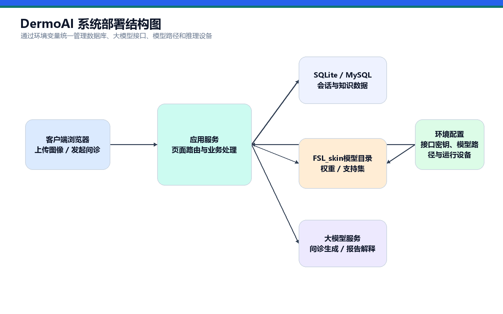

图4-12 系统部署结构图

核心部署配置示例如下：

```env
DB_ENGINE=sqlite
MEDICAL_LLM_MODEL=deepseek-chat
MEDICAL_LLM_API_KEY=your_api_key
MEDICAL_LLM_BASE_URL=your_base_url
INFERENCE_DEVICE=auto
SKIN_DEVICE=auto
FSL_SKIN_PATH=D:/AI/FSL_skin
```

从工程实现角度看，这种部署方式具有三个明显优势：其一，配置项集中且可追踪，便于不同环境间的快速复用；其二，关键外部能力均提供降级策略，不会因单点配置缺失导致整个平台不可用；其三，视觉模型、问诊模型和知识库模块在逻辑上彼此独立，为后续的服务拆分、容器化部署和企业级落地预留了扩展空间。

---

# 第 5 章 测试分析

## 5.1 测试目标

系统测试的目标不是孤立验证某一个页面是否能够打开，而是从业务闭环、工程稳定性、知识可追溯性与环境可迁移性四个层面综合评估 DermoAI 的实现质量。结合本系统“图像识别 + 智能问诊 + RAGGraph 知识增强 + 数据可视化”的复合特点，本文将测试重点划分为以下几个方面：

1. 验证平台入口、问诊工作台、图像分类、知识中枢和数据大屏等核心模块能否形成完整链路。
2. 验证系统在多轮交互、流式响应和知识增强条件下，是否能够稳定返回结构化结果。
3. 验证知识文档上传、切片、检索和图谱构建是否具备可追溯性与可解释性。
4. 验证在外部模型接口不可用、CUDA 缺失、输入不完整等异常条件下，系统是否具备可接受的降级与恢复能力。

需要说明的是，当前章节聚焦于系统级实现验证与工程化测试分析，不对未经完整离线实验复核的分类精度、召回率或 F1 数值进行扩写和推断。换言之，本章强调的是“系统是否真实可运行、链路是否真实可闭环、异常是否真实可处理”，而非脱离现有材料凭空构造实验指标。这样的写法更符合高质量软件作品对真实性和可审阅性的基本要求。

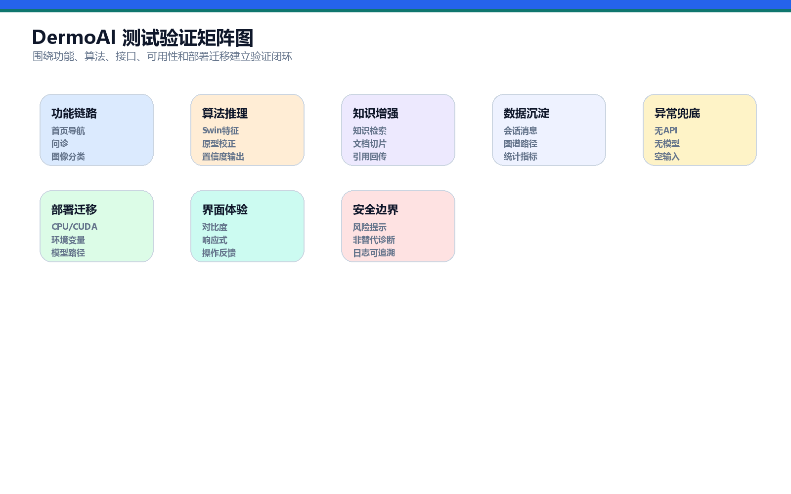

图5-1 测试验证矩阵图

## 5.2 功能测试用例

为保证测试过程覆盖系统的关键实现点，本文采用“页面级验证 + 接口级验证 + 业务级联调”的组合式测试方法。页面级验证关注展示完整性和交互可达性，接口级验证关注输入输出结构和异常处理，业务级联调则关注多模块串联后的实际闭环效果。

表5-1 测试维度设计

| 测试维度 | 主要对象 | 测试重点 | 判定依据 |
| --- | --- | --- | --- |
| 页面访问测试 | 首页、总览、问诊、图像诊断、知识中枢、大屏 | 页面是否可访问、布局是否完整、导航是否连贯 | 页面正常加载、无关键区域缺失 |
| 接口联调测试 | 问诊接口、流式接口、图像上传/预测接口、知识检索接口 | 请求是否成功、返回结构是否完整 | 返回状态正常、关键字段齐全 |
| 数据闭环测试 | 会话、消息、知识条目、知识切片、图谱数据 | 输入后是否形成可保存、可追踪结果 | 数据库产生对应记录 |
| 增强效果测试 | RAG 引用、图谱节点、关系路径 | 是否能够展示证据链而非纯文本回答 | 返回引用、节点、路径与统计信息 |
| 鲁棒性测试 | 空输入、缺图像、缺配置、无 CUDA | 是否存在明确提示或降级逻辑 | 不崩溃且给出可理解反馈 |

表5-2 核心功能测试用例

| 编号 | 测试模块 | 测试内容 | 预期结果 | 测试证据 |
| --- | --- | --- | --- | --- |
| T01 | 平台总览 | 访问首页与平台总览 | 页面结构完整，核心模块入口可点击跳转 | 待补充截图 |
| T02 | 智能问诊 | 输入典型皮肤症状文本 | 返回辅助判断、追问建议和参考依据 | 待补充截图 |
| T03 | 流式问诊 | 调用流式问诊接口 | 前端按片段接收回复并在结束后形成完整记录 | 待补充截图 |
| T04 | 会话管理 | 新建、切换、清空问诊会话 | 会话列表、摘要和消息记录同步更新 | 待补充截图 |
| T05 | 图谱查询 | 输入症状或疾病关键词查询图谱 | 返回图谱节点、关系边、路径和统计指标 | 待补充截图 |
| T06 | 图像上传 | 上传皮肤图像文件 | 文件成功保存并可被后续预测接口读取 | 待补充截图 |
| T07 | 图像预测 | 执行皮肤图像分类 | 返回类别、置信度、提示信息和候选结果 | 待补充截图 |
| T08 | 辅助报告 | 分类后生成解释文本 | 返回大模型分析或本地 fallback 分析 | 待补充截图 |
| T09 | 知识维护 | 新增、修改、删除医学知识条目 | 条目状态更新且检索结果实时变化 | 待补充截图 |
| T10 | 文档入库 | 上传 PDF/TXT 文档并切片 | 文档状态更新为可用并生成知识切片 | 待补充截图 |
| T11 | 知识检索 | 以疾病、症状关键词执行知识检索 | 返回结构化条目、文档证据与图谱信息 | 待补充截图 |
| T12 | 数据大屏 | 访问系统大屏 | 指标卡、趋势图、分布图和关系图可正常渲染 | 待补充截图 |

## 5.3 智能问诊测试

智能问诊模块的测试重点在于验证其是否真正实现了“生成式问答”向“证据增强问诊”的转变。为此，测试不仅检查系统能否给出通顺回答，更关注其是否能够完成上下文保留、知识检索、图谱构建、证据回显和会话归档等关键动作。

在典型用例测试中，输入诸如“手臂出现红斑并伴有瘙痒，持续一周，可能是什么原因”或“面部反复长痤疮并伴有红肿，日常护理需要注意什么”等问题，系统应完成以下处理：首先将输入写入用户消息记录；其次基于历史问答恢复上下文；再次调用 RAG 检索返回结构化医学知识与文档切片；随后输出带有参考依据、图谱节点和候选路径的辅助建议；最后将整轮问答结果落库，供后续继续追问或在数据大屏中统计。

从联调结果看，该模块具备较好的业务完整性。其输出不再停留于单段自然语言文本，而是形成“问答内容 + 参考依据 + 图谱视图 + 会话记录”的复合结果结构。特别是在图谱区域中，系统能够围绕疾病、症状、部位、检查和处理建议建立关系网络，这说明知识增强部分已真实参与回答生成，而非仅作为页面装饰元素存在。

同时，流式接口测试验证了系统在响应较长内容时的交互稳定性。通过 SSE 输出模型片段，可以在后端尚未完成整段生成前持续向前端推送内容，从而显著降低用户感知等待时间。该设计对于医疗咨询类场景尤为关键，因为其直接影响用户对系统响应性和可信度的主观评价。

图5-2 智能问诊测试结果截图  
[此处插入：图5-2 智能问诊测试结果截图]

## 5.4 皮肤图像分类测试

皮肤图像分类测试主要围绕“上传是否成功、模型是否可调用、结果是否可解释、异常是否可恢复”四个维度展开。测试时选择清晰的皮肤病灶图像作为输入，分别验证图像上传接口与预测接口的联动效果。

从上传链路看，系统能够正确接收前端传入的图像文件并写入指定目录，为后续预测提供稳定输入源。从预测链路看，系统在调用 `SkinFSLPredictor` 后，可返回类别名称、置信度、百分比形式结果、基础提示以及候选预测序列，说明视觉推理模块已经形成较完整的输出结构，而不是只输出单个类别编号。

更重要的是，系统在结果解释层完成了进一步增强。分类结果会结合规则提示与自然语言分析展示给用户，使视觉识别结果更贴近医学应用语境。在外部大模型接口不可用或初始化失败时，系统并不会导致整个图像诊断流程中断，而是返回本地 fallback 分析文本。这表明系统在工程设计上充分考虑了外部依赖不稳定场景下的可用性问题。

此外，测试还验证了预测器单例加载策略在重复访问情形下的有效性。由于模型初始化成本通常较高，若每次请求均重新加载权重，将严重影响系统的交互体验。当前实现将预测器实例缓存于服务运行期内，有利于在多次连续测试和演示过程中保持较稳定的响应表现。

图5-3 皮肤图像分类测试结果截图  
[此处插入：图5-3 皮肤图像分类测试结果截图]

## 5.5 知识中枢测试

知识中枢测试主要用于验证系统知识资产能否被稳定写入、规范切片、准确检索并有效参与问诊增强。测试过程包括结构化知识维护、文档入库和检索联动三个方面。

在结构化知识维护测试中，通过新增、编辑与删除医学知识条目，验证系统是否能够对疾病名称、症状描述、检查建议和处理建议进行正确保存，并在列表页和检索接口中即时反映更新结果。该部分测试体现了系统面向后期运营维护的可持续扩展能力。

在文档入库测试中，上传 PDF 或 TXT 文件后，系统应完成文件类型识别、文本抽取、规范化处理、分节切片、状态更新和切片落库等动作。若文档处理成功，页面能够展示文档状态、字符数、切片数等信息；若文档格式不被支持，系统则会明确返回错误提示。该结果表明知识中枢具备从原始文档向 RAG 检索资源转换的基本工程能力。

在检索联动测试中，以疾病名称、症状关键词或检查项目作为查询条件，系统能够返回结构化条目、知识文档片段以及图谱型关系信息。这说明知识中枢并非静态存档页面，而是真正参与到了问诊增强与图谱推理中。对于医疗 AI 平台而言，这种“知识可维护、文档可入库、证据可检索、图谱可扩展”的能力，是其区别于普通聊天机器人系统的关键特征之一。

图5-4 知识中枢测试结果截图  
[此处插入：图5-4 知识中枢测试结果截图]

## 5.6 兼容性与异常测试

为了评估系统在真实运行环境中的稳定性，本文进一步设计了兼容性与异常测试。该部分测试不追求复杂的压力指标，而重点考察系统在常见故障条件下是否能够保持核心业务不中断、错误信息可理解、关键能力可降级。

表5-3 异常与兼容性测试用例

| 编号 | 测试场景 | 预期处理 |
| --- | --- | --- |
| E01 | 智能问诊输入为空 | 返回明确提示，拒绝创建无效消息 |
| E02 | 图像分类未上传图片 | 返回请先上传图像或未找到图像提示 |
| E03 | 大模型 API 未配置 | 问诊或报告模块采用 fallback 机制继续输出 |
| E04 | CUDA 不可用 | 自动回退到 CPU 推理，不影响基本流程 |
| E05 | 知识文档格式不支持 | 返回仅支持 PDF/TXT 的错误提示 |
| E06 | PDF 无可提取文本 | 返回需先进行 OCR 的说明 |
| E07 | 会话被清空后继续访问 | 自动创建新会话并保持页面可用 |

从测试结果分析，系统在异常处理方面具有较明显的工程化特征。

第一，输入校验前置。无论是问诊文本、图像上传还是文档上传，系统均在业务逻辑入口处进行空值或格式校验，避免无效请求进入深层流程。

第二，关键外部依赖可降级。大模型接口不可用时，系统仍能保留本地知识检索、图像识别或 fallback 文本生成能力；CUDA 缺失时，视觉推理可回退至 CPU 模式继续运行。

第三，错误提示具有业务语义。系统返回的并非笼统的服务器错误，而是与当前场景相匹配的提示信息，如“请输入皮肤症状或咨询问题”“仅支持 pdf 或 txt 文件”“未找到上传的图像文件”等，便于用户理解和修正操作。

第四，系统具备较好的环境迁移能力。通过 `INFERENCE_DEVICE`、`SKIN_DEVICE` 和 `FSL_SKIN_PATH` 等配置项，作品可在不同硬件条件和目录结构下完成部署，减少了对固定实验环境的依赖。

## 5.7 测试结论

综合功能测试、链路联调、知识检索测试和异常兼容性测试结果可以看出，DermoAI 已基本形成从多模态输入到结构化结果输出的完整闭环。用户既可以通过文本症状发起智能问诊，获得带参考依据与图谱证据的辅助建议，也可以上传皮肤图像完成视觉识别，并结合知识中枢和数据大屏完成进一步的结果理解与系统观察。

从系统工程角度评价，本作品的测试结果体现出以下几个特点：其一，模块间并非孤立拼接，而是具备较清晰的数据传递关系和状态沉淀能力；其二，知识增强部分已真实参与回答和展示链路，具备一定可解释性；其三，系统对外部依赖和运行环境差异具有一定容错性，适合在比赛答辩、项目展示和后续扩展中持续使用。

当然，若从更高标准的科研型评测视角审视，系统后续仍可在三个方向上继续补强：一是补充更规范的离线实验记录与分类评测报告；二是扩大真实问诊样例与知识库规模，形成更充分的统计依据；三是引入更标准化的前后端自动化测试和性能压测结果。尽管如此，就当前作品形态而言，系统已经完成了“功能可演示、链路可复现、结果可解释、架构可扩展”的核心目标，具备较强的竞赛展示价值与工程实现说服力。

---

# 第 6 章 作品总结

## 6.1 作品特色

DermoAI 的价值在于把皮肤医学辅助诊断从单一模型能力提升为系统化智能平台。作品既有大语言模型的自然交互能力，也有 RAGGraph 的证据约束和路径推理能力；既有 SFEPT 思想下的少样本皮肤图像分类，也有医学知识中枢和数据可视化；既能面向用户进行辅助咨询，也能面向管理者展示运营指标。

在算法层面，作品重点引入 SFEPT 论文中的少样本皮肤图像分类思想，使用 Swin Transformer 提取层次化视觉特征，通过支持集原型和 Bias Diminishing 原型修正缓解少样本分类偏差，使系统能够更贴近皮肤病图像类别多、样本少、差异细微的真实特点。

在工程层面，作品采用 Django 构建统一 Web 平台，通过服务层封装 RAGGraph、图像推理、文档切片和报告生成逻辑，形成清晰的数据流与业务流。同时，系统支持 CPU/CUDA 推理配置和环境变量部署，具备从本地演示向实际应用迁移的基础。

## 6.2 应用价值

本作品可应用于以下场景：

- 基层医疗和校医院皮肤问题初筛。
- 企业员工健康管理与在线咨询入口。
- 医学 AI 教学与科研原型展示。
- 互联网医疗平台的智能问诊与知识增强模块。
- 皮肤图像少样本分类算法的工程化展示。

## 6.3 不足与展望

当前作品仍存在需要进一步完善的方向：

1. 后续可围绕 SFEPT 模型轻量化、ONNX/TensorRT 推理加速和多终端部署继续优化，使算法服务在普通 CPU 环境、边缘设备和云端 GPU 环境中具备更稳定的响应能力。
2. 当前文档不包含自测准确率等指标，后续应补充固定测试集、推理耗时、分类准确率和错误案例分析。
3. 当前 RAGGraph 已完成轻量级实体关系沉淀与路径评分，后续可接入 Neo4j、向量数据库和医学术语标准化体系，实现更复杂的跨文档图检索和社区级知识摘要。
4. 当前系统以辅助诊断为主，后续可加入医生复核、报告导出、隐私脱敏和权限分级。
5. 当前截图仍需在最终运行环境中补齐，以增强参赛文档的可视化说服力。

---

# 参考文献

[1] Wang Y, He J, Ma S. Semantic-enhanced few-shot learning for precise dermatological diagnosis. The Visual Computer, 2026, 42:243. DOI: 10.1007/s00371-026-04440-y.  
[2] Liu Z, Lin Y, Cao Y, et al. Swin Transformer: Hierarchical Vision Transformer using Shifted Windows. ICCV, 2021.  
[3] Snell J, Swersky K, Zemel R. Prototypical Networks for Few-shot Learning. NeurIPS, 2017.  
[4] Esteva A, Kuprel B, Novoa R A, et al. Dermatologist-level classification of skin cancer with deep neural networks. Nature, 2017, 542:115-118.  
[5] Lewis P, Perez E, Piktus A, et al. Retrieval-Augmented Generation for Knowledge-Intensive NLP Tasks. NeurIPS, 2020.  
[6] Edge D, Trinh H, Cheng N, et al. From Local to Global: A Graph RAG Approach to Query-Focused Summarization. arXiv, 2024.  
[7] Zhang D, Du H, Wang X, et al. CMedRAGBot: A Chinese Medical Chatbot Based on Graph RAG and Large Language Models. Interdisciplinary Sciences: Computational Life Sciences, 2025, 17:844-859.  
[8] Ji S, Pan S, Cambria E, et al. A Survey on Knowledge Graphs: Representation, Acquisition, and Applications. IEEE Transactions on Neural Networks and Learning Systems, 2022.  
[9] Chen Z, Wang S, Zhang J, et al. A Few-Shot Learning Method Based on Multiscale Features for Clinical Skin Disease Image Classification. Bioengineering, 2024, 11(1):83.  
[10] 国务院. 新一代人工智能发展规划. 2017.  
[11] 国务院办公厅. 关于促进“互联网+医疗健康”发展的意见. 2018.  
[12] 中共中央、国务院. “健康中国2030”规划纲要. 2016.  
[13] 国家卫生健康委等五部门. 关于促进和规范“人工智能+医疗卫生”应用发展的实施意见. 2025.  
[14] Django Software Foundation. Django Documentation.  
[15] LangChain Documentation. Retrieval and Chat Model Application Documentation.  
[16] Apache ECharts. Graph Series Documentation.

---

# 附录：图表与截图清单

## 附录 A 结构图源文件

| 图号 | 图名 | PNG 图片 | 可编辑源文件 |
| --- | --- | --- | --- |
| 图2-1 | 系统总体架构图 | `docs/figures/plantuml_rendered/fig2-1-system-architecture.png` | `docs/figures/plantuml/fig2-1-system-architecture.puml` |
| 图2-2 | 核心功能模块图 | `docs/figures/plantuml_rendered/fig2-2-functional-modules.png` | `docs/figures/plantuml/fig2-2-functional-modules.puml` |
| 图2-3 | 核心用例图 | `docs/figures/plantuml_rendered/fig2-4-core-use-case.png` | `docs/figures/plantuml/fig2-4-core-use-case.puml` |
| 图2-4 | 核心数据库 E-R 图 | `docs/figures/plantuml_rendered/fig2-3-er-diagram.png` | `docs/figures/plantuml/fig2-5-er-diagram.puml` |
| 图3-1 | SFEPT 模块核心技术框架图 | `docs/figures/plantuml_rendered/fig3-1-sfept-core-framework.png` | `docs/figures/plantuml/fig3-1-sfept-core-framework.puml` |
| 图3-3 | SFEPT 推理流程图 | `docs/figures/plantuml_rendered/fig3-2-sfept-inference-flow.png` | `docs/figures/plantuml/fig2-4-sfept-inference-flow.puml` |
| 图3-5 | RAG 智能问诊时序图 | `docs/figures/plantuml_rendered/fig3-4-rag-sequence.png` | `docs/figures/plantuml/fig2-3-rag-sequence.puml` |
| 图3-6 | 医学知识文档入库与切片流程图 | `docs/figures/export/fig3-5-knowledge-ingestion-flow.png` | `docs/figures/plantuml/fig3-5-knowledge-ingestion-flow.puml` |
| 图3-7 | 辅助诊断闭环数据流图 | `docs/figures/plantuml_rendered/fig3-7-diagnosis-dataflow.png` | `docs/figures/plantuml/fig3-7-diagnosis-dataflow.puml` |
| 图4-12 | 系统部署结构图 | `docs/figures/plantuml_rendered/fig4-12-deployment.png` | `docs/figures/plantuml/fig2-6-deployment.puml` |
| 图5-1 | 测试验证矩阵图 | `docs/figures/plantuml_rendered/fig5-4-test-validation-matrix.png` | `docs/figures/plantuml/fig5-4-test-validation-matrix.puml` |

## 附录 B 需要补充的系统截图

| 截图编号 | 截图内容 | 建议页面 |
| --- | --- | --- |
| S01 | 平台首页 | `/` |
| S02 | 平台总览 | `/index/` |
| S03 | 智能问诊工作台 | `/agent/` |
| S04 | 皮肤图像诊断 | `/diagnose_skin/` |
| S05 | 医学知识中枢 | `/medical/` |
| S06 | 数据大屏 | `/screen/` |
| S07 | 智能问诊测试结果 | `/agent/` |
| S08 | 皮肤图像分类测试结果 | `/diagnose_skin/` |
